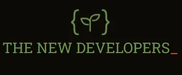

# The New Developers Club Website

Welcome to the official repository for The New Developers (TND) Club Website!

### About

The New Developers is a student-led organization at Mohawk College dedicated to empowering emerging programmers. This website serves as the central hub for our club, providing valuable resources, event details, and a platform for engaging with our community.

### Website Features

#### To Do
- [ ] **Home Page:** A welcoming interface with easy navigation, featuring highlights of recent activities, upcoming events, and quick access to important resources.
- [ ] **About Page:** Provides detailed information about The New Developers Club, including its mission, vision, history, team members, and collaboration details. It also features success stories and testimonials from students.
- [ ] **Contact Us Page:** A section for visitors to make inquiries or provide feedback, including a contact form and essential contact details.
- [ ] **Events Page:** Lists all upcoming and past events, workshops, and sessions with comprehensive details.
- [ ] **Resource Library:** A curated collection of educational materials, articles, guides, and videos.

*Note: This is an evolving project, and more features will be added in the future.*

### Contributing to This Repository:

To contribute to this project, please follow the guidelines and conventions outlined in the Project Outline and the "Guide to Git Workflow" documents. Your adherence to these guidelines ensures a cohesive and efficient development process.

- **Project Outline:** [Project Outline](https://docs.google.com/document/d/1gckErz2vNhz4Wg_sB8u0BOIrs0OSCXWHD__Scoec9pw/edit#heading=h.zd0b0humbjsc)
- **Guide to Git Workflow:** [Guide to Git Workflow](https://docs.google.com/document/d/1rFtcH1D9UOMEW1MUnUNmCOxH-tAo4nVtM6APcs2FxdY/edit)

Please review the "Guide to Git Workflow" document linked within the Project Outline to ensure adherence to established conventions during your contributions.

### Project Lead:

- Mr. Nishkarsh Dubb (Club President) and Mr. Nisarg Nayak are the leads on this project and will be reviewing most of your pull requests. Please ensure your submissions are in line with the project guidelines and standards.

Your contributions, whether in the form of code, documentation, or ideas, are greatly appreciated and vital to the success of this project.
